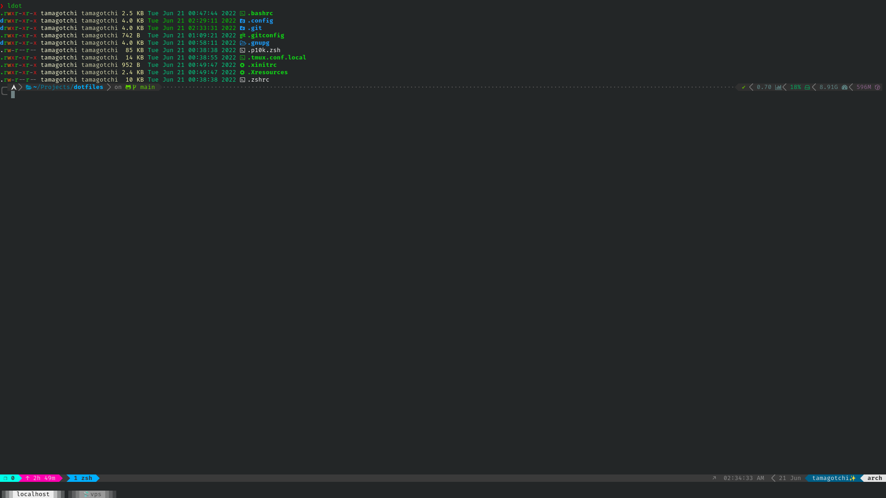
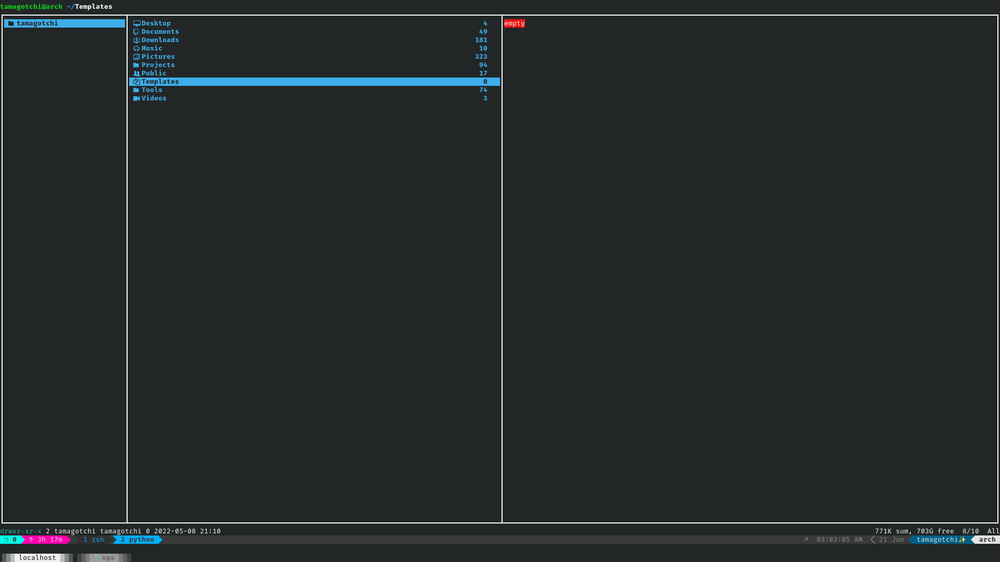
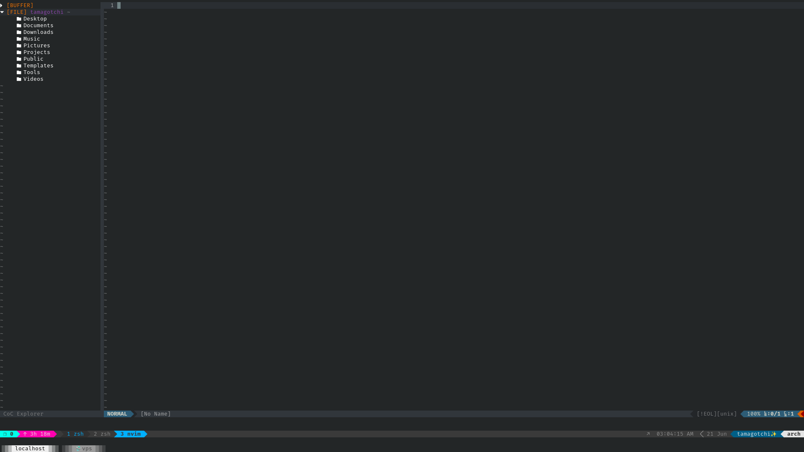

# ℂ𝕠𝕞𝕗𝕪 dotfiles for pєnєtrarnya

what else did you expect to see here?
For more information you have to read dotfiles I'm busy rn =)

Dependency list:
```
exa fzf lsd delta git aria2c tmux jq npm nodejs bat bat-extras grc
```





## ZSH

Install `Antigen` to ~/.antigen

```
mkdir ~/.antigen ; curl -L git.io/antigen > ~/.antigen/antigen.zsh
```

After installation and placing .zshrc into your $HOME directory run 

```
antigen update
```

## Neovim

Check that you have `npm` and `nodejs` installed:

```
which node npm
```

Install `vim-plug`:

```
sh -c 'curl -fLo "${XDG_DATA_HOME:-$HOME/.local/share}"/nvim/site/autoload/plug.vim --create-dirs \
       https://raw.githubusercontent.com/junegunn/vim-plug/master/plug.vim'
```

After installation run:

```
v +PlugInstall
```

Install `coc-explorer`

```
:CocInstall coc-explorer
```

Now you can install any coc extension that you wish =)

## Tmux

Install `oh-my-tmux`

```
cd \
git clone https://github.com/gpakosz/.tmux.git \
ln -s -f .tmux/.tmux.conf \
cp .tmux/.tmux.conf.local .
```

After installation replace `.tmux.conf.local` with exactly the same file from this repo.

## Ranger

Install `ranger_devicons`

```
git clone https://github.com/alexanderjeurissen/ranger_devicons ~/.config/ranger/plugins/ranger_devicons
```

## Bash

Install `FzF Over Bash Complete`

```
git clone https://github.com/lincheney/fzf-tab-completion ~/.local/opt/fzf-obc
```
